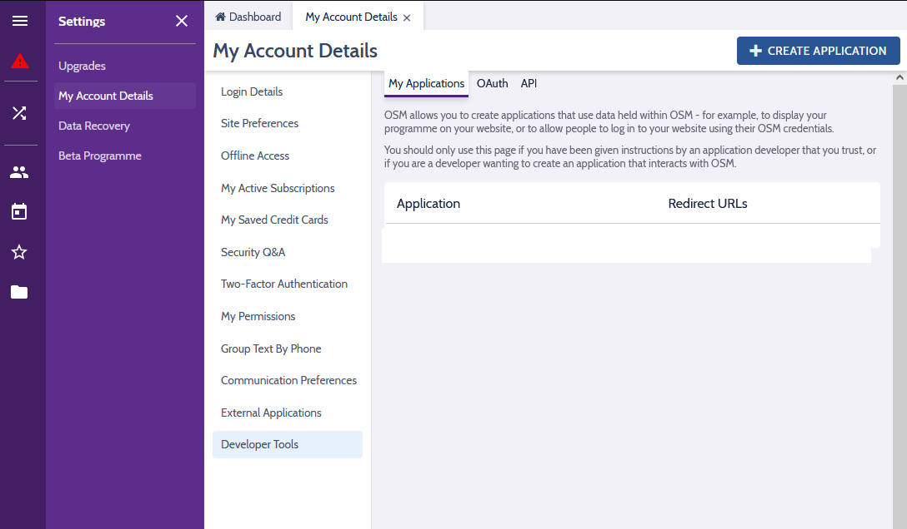
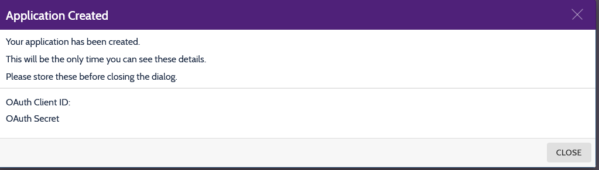

# osm-wordpress-plugin

## Getting started

Before you can use this plugin, you will need to get an OAuth client ID and Secret from the Online Scout Manager website.

If you got to your settings page, and click "Developer Tools" you should see a button to "Create Application"

If you click on this, and enter an appropriate name, you should get a screen showing you your OAuth Cient ID and Secret. Keep these in a safe place as you will need them later.

